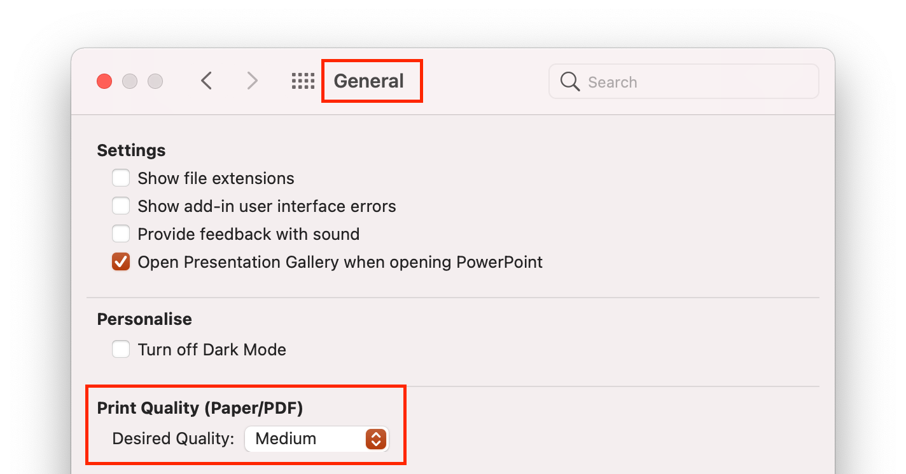

# Reduce PowerPoint File Size

Reduce the file size of a PowerPoint file by:

1. Unpacking the .pptx file
1. Optimizing the media files
    * Convert .tiff to .png
    * Resize images to max. width/height of 1920px (can be changed)
    * Compressing the images with ImageOptim
1. Compressing the unpacked files into the .pptx again
1. 🎉

## Requirements

* Have [ImageOptim](https://imageoptim.com/mac) installed
* Currently, only for MacOS

## How to use

Start the script with:

```bash
sh ./reduce-powerpoint-file-size.sh powerpoint.pptx
```

### Export as .pdf from PowerPoint

A .pdf file exported from PowerPoint can be quite big, when using the highest settings.

To reduce the file size further, the medium export option can be selected.

The option can be find the "General" PowerPoint settings.



## Credits

Originally found at [https://mybyways.com/blog/fixing-powerpoint-tiff-images-and-fonts](https://mybyways.com/blog/fixing-powerpoint-tiff-images-and-fonts)
